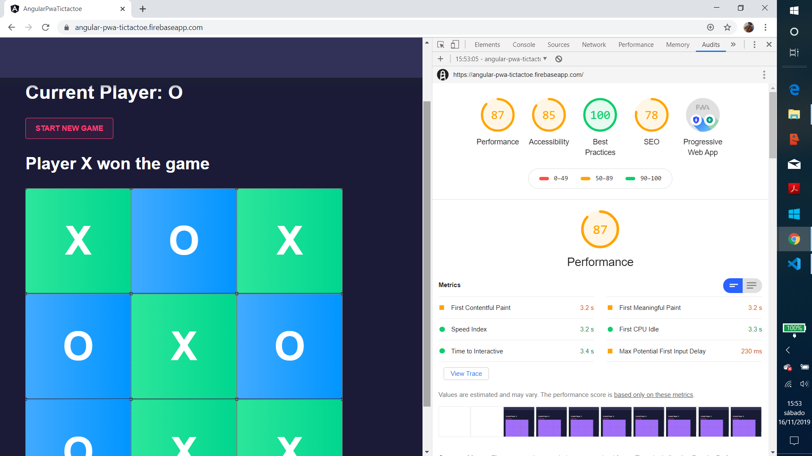

# :zap: Angular PWA TicTacToe

* App using Angular 11 to show a tictactoe game that is deployed to Firestore at [https://angular-pwa-tictactoe.firebaseapp.com/](https://angular-pwa-tictactoe.firebaseapp.com/).
* Tutorial code from [Jeff Delaney at Fireship](https://fireship.io/) - see [:clap: Inspiration](#clap-inspiration) below.

*** Note: to open web links in a new window use: _ctrl+click on link_**

## :page_facing_up: Table of contents

* [:zap: Angular PWA TicTacToe](#zap-angular-pwa-tictactoe)
  * [:page_facing_up: Table of contents](#page_facing_up-table-of-contents)
  * [:books: General info](#books-general-info)
  * [:camera: Screenshots](#camera-screenshots)
  * [:signal_strength: Technologies](#signal_strength-technologies)
  * [:floppy_disk: Setup](#floppy_disk-setup)
  * [:computer: Code Examples](#computer-code-examples)
  * [:cool: Features](#cool-features)
  * [:clipboard: Status & To-Do List](#clipboard-status--to-do-list)
  * [:clap: Inspiration](#clap-inspiration)
  * [:envelope: Contact](#envelope-contact)

## :books: General info

* Simple tictactoe game that shows a message when a player wins.
* Firestore hosting used to make the game available on the web.
* [Angular service worker](https://angular.io/guide/service-worker-intro) added to manage app caching and help this to be a Progressive Web App (PWA).

## :camera: Screenshots

.

## :signal_strength: Technologies

* [Angular v11](https://angular.io/)
* [Nebular UI Customising v6](https://akveo.github.io/nebular/)]
* [Angular Service Worker](https://github.com/angular/angular)
* [Angular Firebase library](https://www.npmjs.com/package/@angular/fire)

## :floppy_disk: Setup

* Install dependencies then run `ng serve` for a dev server. Navigate to `http://localhost:4200/`. The app does automatically reload if you change any of the source files
* Run `ng build` to create the build file
* Run `firebase use --add` to link this app to firebase project already created, then `firebase deploy` to deploy app
* See the app on the web at [https://angular-pwa-tictactoe.firebaseapp.com/](https://angular-pwa-tictactoe.firebaseapp.com/)

## :computer: Code Examples

* Code to calculate the winner, by Jeff Delaney at [Fireship.io](https://fireship.io/).

```typescript
calculateWinner() {
    const lines = [
      [0, 1, 2],
      [3, 4, 5],
      [6, 7, 8],
      [0, 3, 6],
      [1, 4, 7],
      [2, 5, 8],
      [0, 4, 8],
      [2, 4, 6]
    ];
    for (let i = 0; i < lines.length; i++) {
      const [a, b, c] = lines[i];
      if (
        this.squares[a] &&
        this.squares[a] === this.squares[b] &&
        this.squares[a] === this.squares[c]
      ) {
        return this.squares[a];
      }
    }
    return null;
  }
```

## :cool: Features

* Game works offline thanks to the PWA service worker.
* Updated to latest Angular v11 and all dependencies updated.

## :clipboard: Status & To-Do List

* Status: Working, deployed to [https://angular-pwa-tictactoe.firebaseapp.com/](https://angular-pwa-tictactoe.firebaseapp.com/).
* To-Do: Improve lighthouse score (currently 85%).

## :clap: Inspiration

* [Fireship: Youtube tutorial 'Angular for Beginners - Let's build a Tic-Tac-Toe PWA'](https://www.youtube.com/watch?v=G0bBLvWXBvc)]

## :envelope: Contact

* Repo created by [ABateman](https://www.andrewbateman.org) - feel free to contact me!
